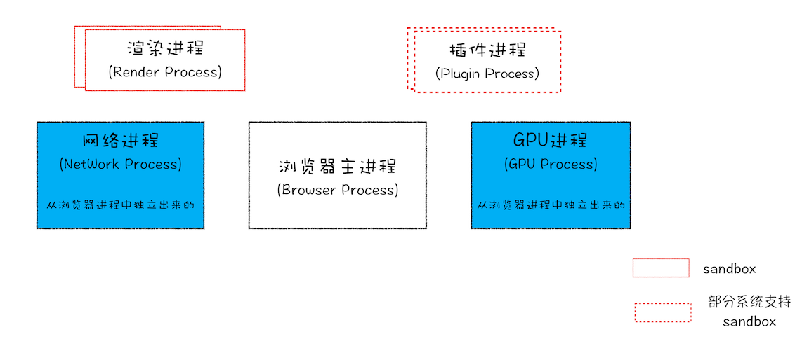

## 进程和线程
`多线程`可以并行处理任务，但是线程不能单独存在，它是由进程来启动和管理的

`进程`就是一个程序的运行实例： 启动一个程序的时候，操作系统会为该程序创建一块内存，用来存放代码、运行中的数据和一个执行任务的<b>主线程</b>，我们把这样的一个运行环境叫 进程

线程是依附于进程的， 而进程中使用多线程并行处理能提升运算效率。
- 进程中的任意一个线程执行出错，都会导致整个进程的崩溃
- 线程之间共享进程中的数据
- 当一个进程关闭之后，操作系统会回收进程所占用的内存
- 进程之间的内容相互隔离

## 浏览器的多进程架构

1. 浏览器进程： 主要负责界面显示、用户交互、子进程管理，同时提供存储等功能
2. 渲染进程： 核心任务是将 HTML、CSS和JS转成用户可以与之交互的网页，排版引擎Blink 和javaScript引擎V8都是运行在该进程中的。默认情况下，Chrome会为每个Tab标签创建一个渲染进程，出于安全考虑，渲染进程都是运行在沙箱模式下。
   
     -   通常情况下是一个页面使用一个进程，但是，有一种情况，叫"同一站点(same-site)"，具体地讲，我们将“同一站点”定义为根域名加上协议（例如，https:// 或者http://），还包含了该根域名下的所有子域名和不同的端口，都是属于同一站点，因为它们的协议都是https，而根域名也都是相同。你也许了解同源策略，但是同一站点和同源策略还是存在一些不同地方，在这里你需要了解它们不是同一件事就行了。
     - Chrome的默认策略是，每个标签对应一个渲染进程。但是如果从一个页面打开了新页面，而新页面和当前页面属于同一站点时，那么新页面会复用父页面的渲染进程。官方把这个默认策略叫process-per-site-instance。
     - 直白的讲，就是如果几个页面符合同一站点，那么他们将被分配到一个渲染进程里面去。所以，这种情况下，一个页面崩溃了，会导致同一站点的页面同时崩溃，因为他们使用了同一个渲染进程。
     - 为什么要让他们跑在一个进程里面呢？因为在一个渲染进程里面，他们就会共享JS的执行环境，也就是说A页面可以直接在B页面中执行脚本。因为是同一家的站点，所以是有这个需求的。
3. GPU进程： 其实chrome刚开始发布的时候是没有GPU进程的，而GPU的使用初衷是为了实现3D CSS的效果，只是随后网页、chrome的UI界面都选择采用GPU来绘制，这使得GPU成为浏览器普遍的需求，最后，Chrome在其多进程架构上引入了GPU进程
4. 网络进程： 主要负责页面的网络资源加载，之前是作为一个模块运行在浏览器进程里面的，直到最近才独立出来，成为一个单独的进程
5. 插件进程：主要负责插件的运行，因插件易崩溃，所以需要通过插件进程来隔离，以保证插件进程崩溃 不会对浏览器和页面造成影响

